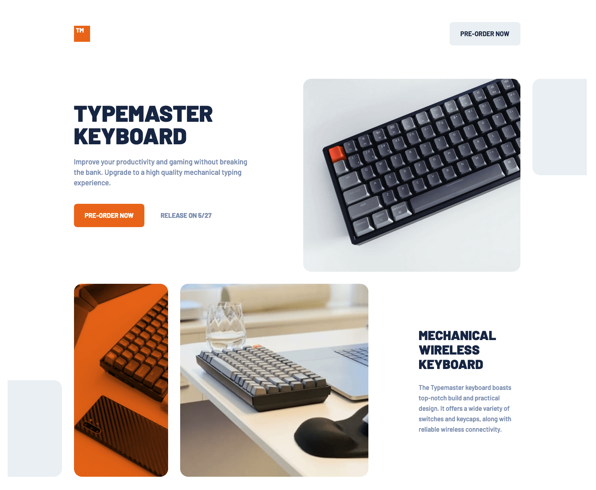

# Frontend Mentor - Typemaster pre-launch landing page solution

This is a solution to the [Typemaster pre-launch landing page challenge on Frontend Mentor](). Frontend Mentor challenges help you improve your coding skills by building realistic projects.

## Table of contents

- [Overview](#overview)
  - [The challenge](#the-challenge)
  - [Screenshot](#screenshot)
  - [Links](#links)
- [My process](#my-process)
  - [Built with](#built-with)
  - [What I learned](#what-i-learned)
- [Author](#author)

## Overview

### The challenge

Users should be able to:

- View the optimal layout for the landing page depending on their device's screen size

### Screenshot

### Links

- Solution URL: [Add solution URL here](https://your-solution-url.com)
- Live Site URL: [https://madmanden.github.io/typemaster-landing-page/](https://madmanden.github.io/typemaster-landing-page/)

## My process

### Built with

- Semantic HTML5 markup
- Flexbox
- CSS Grid
- Mobile-first workflow
- [SASS](https://sass-lang.com/)
- [BEM](https://en.bem.info/)

### What I learned

I used a bit of CSS grid in this challenge. I look forward to using it more. Flexbox and grid is a powerful combination. Personally I'm glad the days of table layout are gone :)

## Author

- GitHub - [Madmanden](https://github.com/Madmanden)
- Twitter - [Madmanden](https://twitter.com/Madmanden)
- Website - [Christian Holm](https://www.christianholm.dev)
- FrontendMentor - [@Madmanden](https://www.frontendmentor.io/profile/Madmanden)
- Blog - [Blog](https://hashnode.com/@christianholm)
